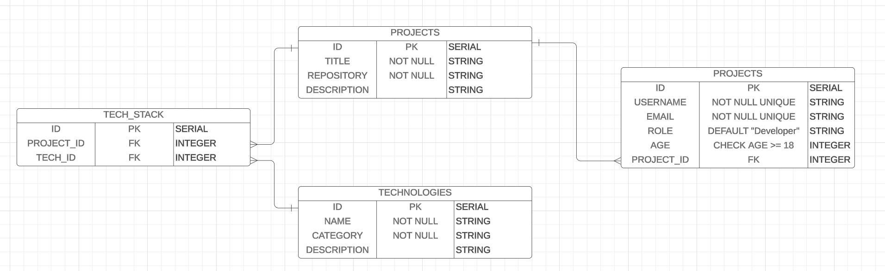

# hackathons-api

## 03/08 lesson. SQL 

### ERD

In this Hackathon environment ERD, projects are created and can have multiple members assigned to them. Each member can only be associated with one project. Projects can also have a tech stack consisting of multiple technologies, and each technology can be used in multiple projects. This ERD helps students understand the relationships between projects, members, and technologies within a hackathon context.

- Connect to postgres.
- Create the database.
- Create the tables and insert the data.
- Simple queries.
- Delete and update.
- Create a script.

## 05/08 lesson. ORM

We will create a new database today. The purpose is still to store information about the Hackathon, but also start creating the API with Flask. Using an ORM (SQLAlchemy) we will be able to connect the app to a database and do all the db related tasks we already know from the app. In order to learn how to create the tables from scratch and to avoid conflicts with the previous database, we will create a new one.

- Create the project (venv, flask, and first run)
- Connect to a database (create, user, set the connection with flask)
- Create a project model and a table
- Seed tables command
- Drop tables command
- Schemas
- Get all projects
- ...
- Find a project by id
- Create a project
- Delete a project
- Update a project 