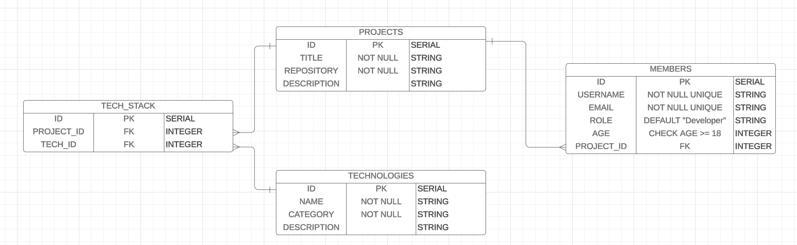

# hackathons-api

## ERD

In this Hackathon environment ERD, projects are created and can have multiple members assigned to them. Each member can only be associated with one project. Projects can also have a tech stack consisting of multiple technologies, and each technology can be used in multiple projects. This ERD helps students understand the relationships between projects, members, and technologies within a hackathon context.

- Connect to postgres
- Create the database
- Create the tables and insert the data
- Simple queries
- Delete and update 
- Create a script